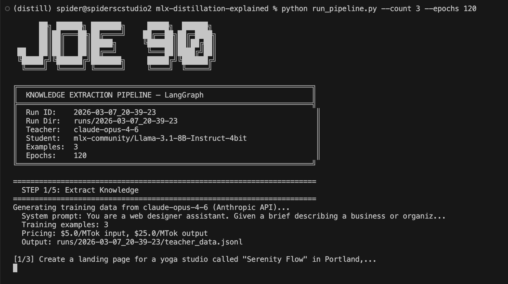
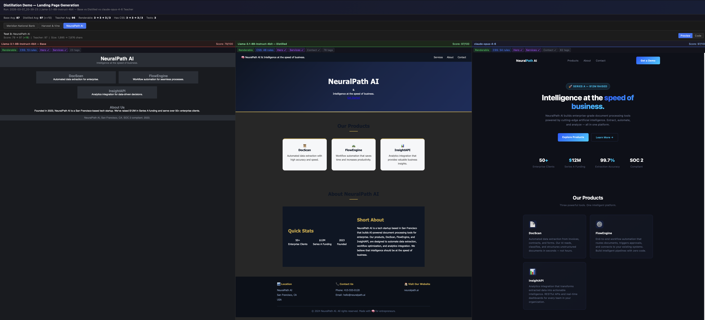
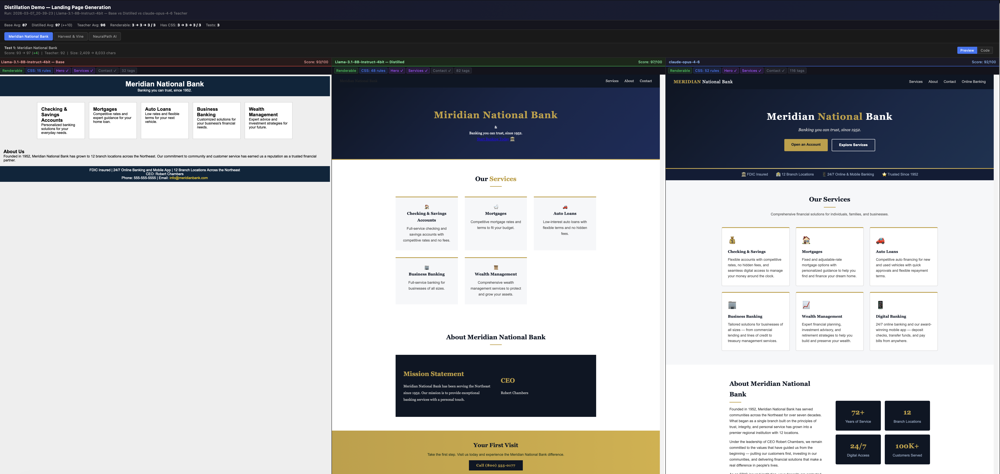
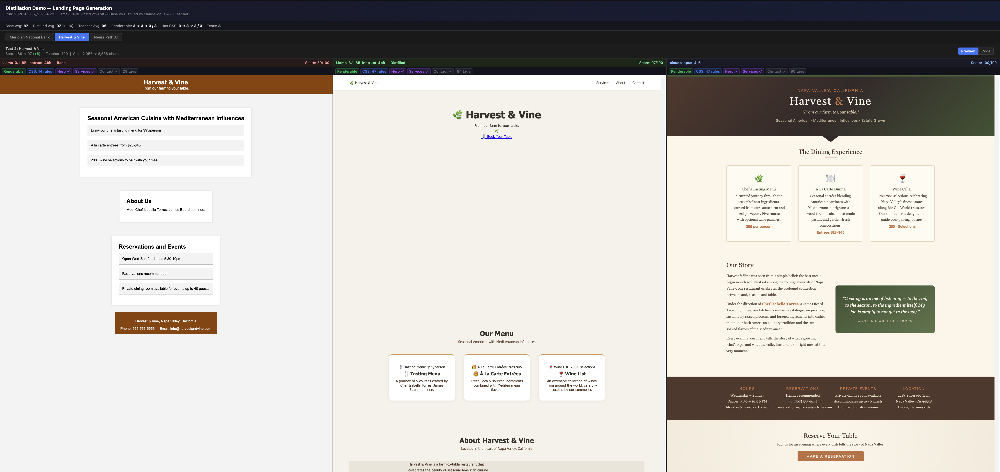
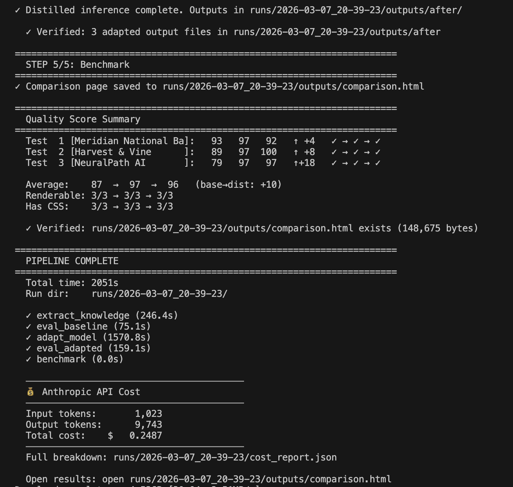
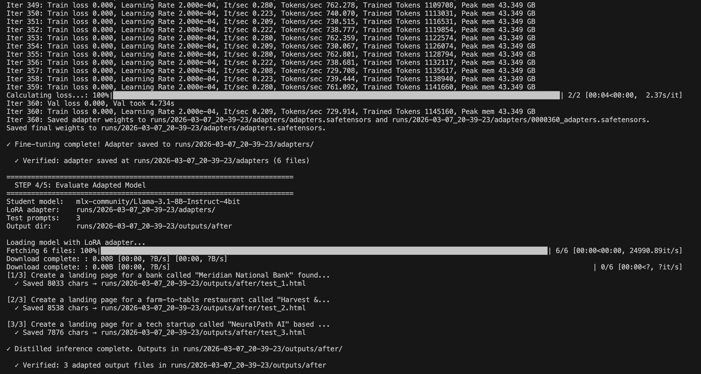
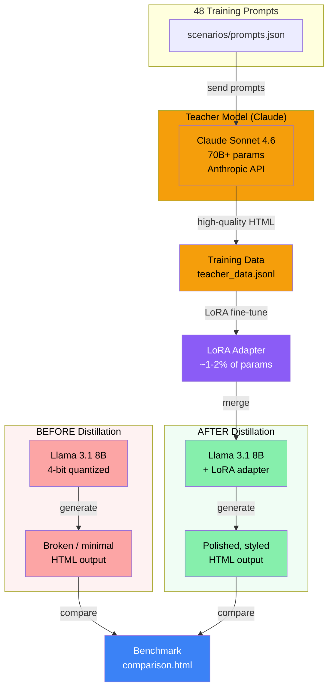
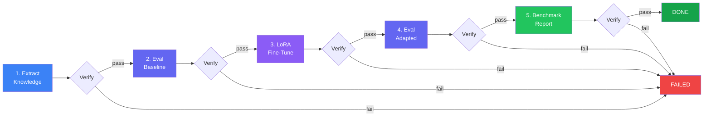

# MLX Distillation PoC

Distill frontend-generation behavior from a larger Anthropic teacher model into a smaller MLX student model using LoRA, then benchmark before vs after quality.

## Why this PoC exists

On February 23, 2026, Anthropic published a detailed report documenting what they called an ["organized distillation campaign"](https://www.anthropic.com/news/detecting-and-preventing-distillation-attacks) — competing labs systematically extracting frontier model capabilities through coordinated networks of fake accounts. The numbers were staggering: 24,000+ fake accounts, 16 million exchanges, and industrial-scale extraction of chain-of-thought reasoning, tool use, and agentic behavior.



The term "distillation" appeared everywhere in the coverage, but many readers — including experienced engineers and technical leaders — weren't sure what it meant in practice. How does a small model actually learn from a large one? What does the process look like? How dramatic is the difference?

This proof-of-concept was built to answer those questions. It demonstrates the fundamental mechanic of model distillation at an educational scale: a frontier model (Claude Sonnet) acts as the "teacher," a local model (Llama 3.1 8B) acts as the "student," and LoRA fine-tuning bridges the gap. The before/after comparison makes the effect tangible.

<p>
<a href="images/2.png"></a>
<a href="images/3.png"></a>
<a href="images/uno.png"></a>
</p>

**This project is strictly informational and educational.** It demonstrates a standard machine learning technique — one that is taught in university courses, documented in OpenAI's own fine-tuning guides, and covered in foundational ML textbooks (Hinton et al., 2015). The scale here (48 prompts, a single local model, a narrow HTML-generation task) is deliberately minimal, designed to illustrate the concept rather than produce a production-quality distillation.

**What this project does NOT cover:** None of the adversarial techniques described in Anthropic's report are part of this PoC. There is no fake account creation, no residential proxy rotation, no rate-limit evasion, no automated capability extraction at scale, and no safety-stripping or alignment removal. Those techniques are what distinguish an organized extraction campaign from a textbook learning exercise — and that distinction is precisely the point.

Understanding the mechanic is a prerequisite for having an informed opinion about the policy, security, and access implications that follow from it.

## What this repo does

This project runs a 5-step distillation workflow:

1. Extract teacher examples from Anthropic (`01_extract_knowledge.py`)
2. Evaluate baseline student model (`02_eval_baseline.py`)
3. Fine-tune student with MLX LoRA (`03_adapt_model.py`)
4. Evaluate adapted student (`04_eval_adapted.py`)
5. Build side-by-side benchmark report (`05_benchmark.py`)

The recommended entry point is `run_pipeline.py`, which orchestrates all steps via LangGraph and verifies outputs between steps.

<p>
<a href="images/4.png"></a>
<a href="images/5.png"></a>
</p>

### How distillation works



### Pipeline flow



## Requirements

- macOS on Apple Silicon (M1/M2/M3/M4)
- Python 3.10+
- Anthropic API key (`ANTHROPIC_API_KEY`)
- Enough memory for 4-bit Llama 3.1 8B + LoRA training (typically ~6-10GB total headroom)

## Setup

```bash
python -m venv .venv
source .venv/bin/activate
pip install -r requirements.txt
```

Set your API key (or place it in `.env`):

```bash
export ANTHROPIC_API_KEY="sk-ant-..."
```

## Quickstart (full pipeline)

Run everything end-to-end:

```bash
python run_pipeline.py
```

Quick smoke test:

```bash
python run_pipeline.py --count 3 --epochs 1
```

Custom run id:

```bash
python run_pipeline.py --run-id experiment-v2
```

Generate cost-impact workbook after the run:

```bash
python run_pipeline.py --cost-estimate
```

### Useful pipeline flags

- `--teacher-model` (default: `claude-sonnet-4-6`)
- `--student-model` (default: `mlx-community/Llama-3.1-8B-Instruct-4bit`)
- `--count` (limit training examples; default uses all 48)
- `--epochs`, `--lora-rank`, `--num-layers`, `--learning-rate`, `--batch-size`
- `--max-tokens` (inference max output tokens)
- `--run-id` (defaults to timestamp under `runs/`)
- `--cost-estimate` (generate XLSX summary)

## Run outputs

Each pipeline run writes to `runs/<run-id>/` and stores:

- inputs/derived training files
- LoRA adapters
- baseline outputs (`outputs/before/`)
- adapted outputs (`outputs/after/`)
- benchmark HTML (`outputs/comparison.html`)
- run metadata (`run_config.json`, `run_results.json`)
- API cost details (`cost_report.json`)
- optional workbook (`cost_impact_analysis.xlsx`)

Open the comparison page after a run:

```bash
open runs/<run-id>/outputs/comparison.html
```

## Running steps manually (standalone)

You can run steps individually with a shared `--run-dir`:

```bash
python 01_extract_knowledge.py --run-dir runs/manual-test --count 10
python 02_eval_baseline.py --run-dir runs/manual-test
python 03_adapt_model.py --run-dir runs/manual-test --epochs 4
python 04_eval_adapted.py --run-dir runs/manual-test
python 05_benchmark.py --run-dir runs/manual-test
open runs/manual-test/outputs/comparison.html
```

## Optional cost impact report

From an existing run directory:

```bash
python cost_estimate.py runs/<run-id>
```

Or specify an output file:

```bash
python cost_estimate.py runs/<run-id> --output my_estimate.xlsx
```

## Prompt dataset

Prompts live in `scenarios/prompts.json` and include:

- `system_prompt`
- `training_prompts` (48)
- `test_prompts` (5)

## Project structure

```
mlx-distillation-poc/
├── run_pipeline.py              # LangGraph orchestrator (recommended entry)
├── 01_extract_knowledge.py      # Anthropic teacher generation + train/valid data
├── 02_eval_baseline.py          # Student baseline inference
├── 03_adapt_model.py            # MLX LoRA fine-tuning
├── 04_eval_adapted.py           # Student + adapter inference
├── 05_benchmark.py              # Side-by-side HTML benchmark report
├── cost_estimate.py             # XLSX cost/time extrapolation from run data
├── scenarios/
│   └── prompts.json
├── requirements.txt
└── README.md
```

## Notes

- API spend is incurred during step 1 and written to `cost_report.json`.
- The pipeline validates expected artifacts after each step and stops on failure.
- Distilled quality is measured by the benchmark script's heuristic score (0-100) on generated HTML structure/styling features.
